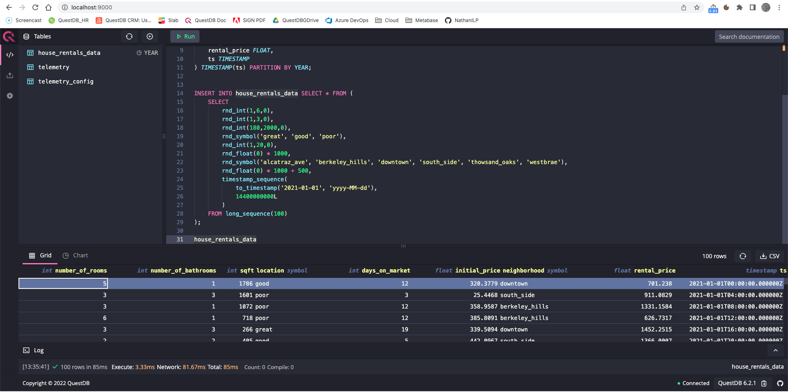

# Using QuestDB as a datasource for MindsDB

## Introduction

[MindsDB](https://mindsdb.com/) enables you to use Machine Learning to ask predictive questions about your data 
and receive accurate answers from it, all **in SQL**. With MindsDB: 

- *Developers* can quickly add AI capabilities to their applications.
- *Data scientists* can streamline MLOps by deploying ML models as 
  [AI Tables](https://docs.mindsdb.com/sql/tutorials/ai-tables/?h=ai#deep-dive-into-the-ai-tables).
- *Data analysts* can easily make forecasts on complex data, such as multivariate time-series with high 
  cardinality, and visualize these in BI tools like [Grafana](https://grafana.com/), and 
  [Tableau](https://www.tableau.com/).
 
[QuestDB](https://questdb.io/) is **the fastest open-source**, column-oriented SQL database for time-series data. 
It has been designed and built for massively-parallelized vectorized execution and SIMD, as the de-facto backend 
for high-performance demanding applications in financial services, IoT, IIoT, ML, MLOps, DevOps and observability. 
QuestDB implements **ANSI SQL with additional extensions for time-specific queries**, which make it simple to correlate 
data from multiple sources using relational and time series [joins](https://questdb.io/docs/reference/sql/join), and 
execute [aggregation functions](https://questdb.io/docs/reference/function/aggregation) with simplicity and speed.
In addition, QuestDB is resource efficient (comparatively cheaper than other projects to run in cloud environments), 
simple to install, manage, use, and stable in all [production environments](https://questdb.io/customers/).   

Combining both MindsDB and QuestDB gives you unbound prediction ability with SQL. You can perform all the pre-processing 
of your data inside QuestDB using its powerful and [unique extended SQL](https://questdb.io/docs/concept/sql-extensions), 
and then you can access these data from MindsDB, in its own [also unique SQL](https://docs.mindsdb.com/sql/), to produce 
powerful ML models.

The main goal of this article is to gently introduce these two deep technologies and give you enough 
understanding to be able to undertake very ambitious ML projects. To that end we will:

- Spawn two Docker containers to run **MindsDB** and **QuestDB**.
- Add **QuestDB** as a datasource to **MindsDB** using a SQL Statement.
- Create a table and add data for a simple ML use case using **QuestDB**'s web console.
- Connect to **MindsDB** using `mysql` client and write some SQL.
- Create a predictor for our ML use case.
- Make some predictions about our data.

Have fun!

## Requirements

- [docker-compose](https://docs.docker.com/compose/install/): To define and run our multi-container 
  Docker application (it is usually installed implicitly when Docker is installed).
- [MySQL](https://dev.mysql.com/doc/refman/8.0/en/mysql.html): The client we will use to interact with MindsDB
  (`mysql -h 127.0.0.1 --port 47335 -u mindsdb -p`).
     
- [Curl](https://curl.se/download.html): To upload data to QuestDB 
  from a local [CSV file](./sample_house_rentals_data.csv).

Software repositories in case you are inclined to look under the hood (**Give us a star!**):
- MindsDB: [https://github.com/mindsdb/mindsdb](https://github.com/mindsdb/mindsdb).
- QuestDB: [https://github.com/questdb/questdb](https://github.com/questdb/questdb).

## Running our multi-container Docker application

We have this [**docker-compose.yaml**](./docker-compose.yaml) file:

```yaml
version: '3.8'

services:
  questdb:
    image: questdb/questdb:latest
    container_name: questdb
    pull_policy: "always"
    restart: "always"
    ports:
      - "8812:8812"
      - "9000:9000"
      - "9009:9009"
    volumes:
      - ./qdb_root:/root/.questdb

  mindsdb:
    image: mindsdb/mindsdb:latest
    container_name: mindsdb
    restart: "always"
    ports:
      - "47334:47334"
      - "47335:47335"
    volumes:
      - .:/root
    depends_on:
      - questdb

networks:
  default:
    name: mindsdb-network
    driver: bridge
```

which allows us to start our two service containers with command:

```shell
docker-compose up -d
```

- Container `questdb`: Creates a local folder **qdb_root** to store table data/metadata, and the default server 
  configuration => available at [localhost:9000](http://localhost:9000).
- Container `mindsdb`: Creates two local folders **mindsdb_store**, **nltk_data**, and uses configuration file 
  [**mindsdb_config.json**](./mindsdb_config.json).
  
MindsDB takes about 60-90 seconds to become available, logs can be followed in the terminal:

```shell
docker logs -f mindsdb
...
Version 22.3.1.0
Configuration file:
   /root/mindsdb_config.json
Storage path:
   /root/mindsdb_store
http API: starting...
mysql API: starting...
mongodb API: starting...
 ✓ telemetry enabled
 ✓ telemetry enabled
 ✓ telemetry enabled
mongodb API: started on 47336
mysql API: started on 47335
http API: started on 47334
```

We can stop the two containers with command:

```shell
docker-compose down
```

We can remove all persisted data and configuration executing:

```shell
./remove_persisted_data.sh
``` 

Note: Doing this means that the next time you start the containers you will need to add QuestDB as a datasource again,
as well as recreate the table, add data, and recreate your ML models.

## Adding data to QuestDB

We can access QuestDB's web console at [localhost:9000](http://localhost:9000):



and execute this DDL query to create a simple table (copy this query to the web console, select it and click `Run`):

```sql
CREATE TABLE IF NOT EXISTS house_rentals_data (
    number_of_rooms INT,
    number_of_bathrooms INT,
    sqft INT,
    location SYMBOL,
    days_on_market INT,
    initial_price FLOAT,
    neighborhood SYMBOL,
    rental_price FLOAT,
    ts TIMESTAMP
) TIMESTAMP(ts) PARTITION BY YEAR;
```

We can upload data from a [local CSV file](./sample_house_rentals_data.csv) to QuestDB:

```shell
curl -F data=@sample_house_rentals_data.csv "http://localhost:9000/imp?forceHeader=true&name=house_rentals_data"
```
More information available [here!](https://questdb.io/docs/develop/insert-data#rest-api).

We could equally populate table `house_rentals_data` with random data ([excellent tutorial on this](https://questdb.io/tutorial/2022/03/14/mock-sql-timeseries-data-questdb/)):

```sql
INSERT INTO house_rentals_data SELECT * FROM (
    SELECT 
        rnd_int(1,6,0),
        rnd_int(1,3,0),
        rnd_int(180,2000,0),
        rnd_symbol('great', 'good', 'poor'),
        rnd_int(1,20,0),
        rnd_float(0) * 1000,
        rnd_symbol('alcatraz_ave', 'berkeley_hills', 'downtown', 'south_side', 'thowsand_oaks', 'westbrae'),
        rnd_float(0) * 1000 + 500,
        timestamp_sequence(
            to_timestamp('2021-01-01', 'yyyy-MM-dd'),
            14400000000L
        )
    FROM long_sequence(100)
);
```

Either way, this gives us 100 data points, one every 4 hours, from 2021-01-16T12:00:00.000000Z (QuestDB's timestamps 
are UTC with microsecond precision), conveniently downloaded to file [sample_house_rentals_data.csv](./sample_house_rentals_data.csv).
 
NOTE: If you tried the last query, you will have 200 rows, you can `truncate table house_rentals_data` and run the curl 
command again, in QuestDB data are immutable.


## Connecting to MindsDB

We can connect to MindsDB with a standard mysql-wire-protocol compliant client (no password, hit ENTER):

```shell
mysql -h 127.0.0.1 --port 47335 -u mindsdb -p
```

Only two databases are relevant to us, **questdb** and **mindsdb**

```shell
mysql> SHOW DATABASES;
+--------------------+
| Database           |
+--------------------+
| information_schema |
| mindsdb            |
| files              |
| views              |
| questdb            |
+--------------------+
5 rows in set (0.34 sec) 
```

To see `questdb` as a database we need to add it:
  
```shell
mysql> USE mindsdb;
Database changed
  
mysql>  
CREATE DATASOURCE questdb
    WITH ENGINE = "questdb",
    PARAMETERS = {
        "user": "admin",
        "password": "quest",
        "host": "questdb",
        "port": "8812",
        "database": "questdb",
        "public": true
    };
```

### questdb 

This is a read-only view on our QuestDB instance. We can query it leveraging the full power of 
QuestDB's unique SQL syntax because statements are sent from MindsDB to QuestDB without interpreting 
them. It only works for *SELECT* statements (it requires activation by means of **USE questdb;**): 

```shell
mysql> USE questdb;
Database changed
  
mysql> 
SELECT
    ts,
    neighborhood, 
    sum(days_on_market) DaysLive,
    min(rental_price) MinRent,
    max(rental_price) MaxRent,
    avg(rental_price) AvgRent
FROM house_rentals_data
WHERE ts BETWEEN '2021-01-08' AND '2021-01-10'
SAMPLE BY 1d FILL (0, 0, 0, 0);

+--------------+----------------+----------+----------+----------+--------------------+
| ts           | neighborhood   | DaysLive | MinRent  | MaxRent  | AvgRent            |
+--------------+----------------+----------+----------+----------+--------------------+
| 1610064000.0 | south_side     | 19       | 1285.338 | 1285.338 | 1285.338134765625  |
| 1610064000.0 | downtown       | 7        | 1047.14  | 1047.14  | 1047.1396484375    |
| 1610064000.0 | berkeley_hills | 17       | 727.52   | 727.52   | 727.5198974609375  |
| 1610064000.0 | westbrae       | 36       | 1038.358 | 1047.342 | 1042.85009765625   |
| 1610064000.0 | thowsand_oaks  | 5        | 1067.319 | 1067.319 | 1067.318603515625  |
| 1610064000.0 | alcatraz_ave   | 0        | 0.0      | 0.0      | 0.0                |
| 1610150400.0 | south_side     | 10       | 694.403  | 694.403  | 694.4031982421875  |
| 1610150400.0 | downtown       | 16       | 546.798  | 643.204  | 595.0011291503906  |
| 1610150400.0 | berkeley_hills | 4        | 1256.49  | 1256.49  | 1256.4903564453125 |
| 1610150400.0 | westbrae       | 0        | 0.0      | 0.0      | 0.0                |
| 1610150400.0 | thowsand_oaks  | 0        | 0.0      | 0.0      | 0.0                |
| 1610150400.0 | alcatraz_ave   | 14       | 653.924  | 1250.477 | 952.2005004882812  |
| 1610236800.0 | south_side     | 0        | 0.0      | 0.0      | 0.0                |
| 1610236800.0 | downtown       | 9        | 1357.916 | 1357.916 | 1357.9158935546875 |
| 1610236800.0 | berkeley_hills | 0        | 0.0      | 0.0      | 0.0                |
| 1610236800.0 | westbrae       | 0        | 0.0      | 0.0      | 0.0                |
| 1610236800.0 | thowsand_oaks  | 0        | 0.0      | 0.0      | 0.0                |
| 1610236800.0 | alcatraz_ave   | 0        | 0.0      | 0.0      | 0.0                |
+--------------+----------------+----------+----------+----------+--------------------+
18 rows in set (0.18 sec)
```
  
Beyond SELECT statements, for instance when we need to save the results of a query into a new table,
we need to use QuestDB's web console available at [localhost:9000](http://localhost:9000):

```sql
CREATE TABLE sample_query_results AS (
    SELECT
        ts,
        neighborhood, 
        sum(days_on_market) DaysLive,
        min(rental_price) MinRent,
        max(rental_price) MaxRent,
        avg(rental_price) AvgRent
    FROM house_rentals_data
    WHERE ts BETWEEN '2021-01-08' AND '2021-01-10'
    SAMPLE BY 1d FILL (0, 0, 0, 0)
) TIMESTAMP(ts) PARTITION BY MONTH;
```

### mindsdb

Contains the metadata tables necessary to create ML models and add new data sources:

```shell
mysql> USE mindsdb;
Database changed
  
mysql> SHOW TABLES;
+-------------------+
| Tables_in_mindsdb |
+-------------------+
| predictors        |  
| commands          |
| datasources       |
+-------------------+
3 rows in set (0.17 sec)
  
mysql> SELECT * FROM datasources;
+---------+---------------+---------+------+-------+
| name    | database_type | host    | port | user  |
+---------+---------------+---------+------+-------+
| questdb | questdb       | questdb | 8812 | admin |
+---------+---------------+---------+------+-------+
1 row in set (0.19 sec)
```

## Creating a predictor

We can create a predictor model `mindsdb.home_rentals_model_ts` to predict the `rental_price` 
for a `neighborhood` considering the past 20 days, and no additional features:

```shell
mysql> USE mindsdb;
Database changed

mysql>
CREATE PREDICTOR mindsdb.home_rentals_model_ts FROM questdb (
    SELECT
        neighborhood,
        rental_price,
        ts
    FROM house_rentals_data
) 
PREDICT rental_price ORDER BY ts GROUP BY neighborhood
WINDOW 20 HORIZON 1;
```

This triggers MindsDB to create/train the model based on the full data available from QuestDB's table 
`house_rentals_data` (100 rows) as a timeseries on column `ts`.

You can see the progress by monitoring the log output of the `mindsdb` Docker container, and you can
ask MindsDB directly:

```shell
mysql> SELECT * FROM predictors;
+-----------------------+------------+----------+--------------+---------------+-----------------+-------+-------------------+------------------+
| name                  | status     | accuracy | predict      | update_status | mindsdb_version | error | select_data_query | training_options |
+-----------------------+------------+----------+--------------+---------------+-----------------+-------+-------------------+------------------+
| home_rentals_model_ts | generating | NULL     | rental_price | up_to_date    | 22.4.3.0        | NULL  |                   |                  |
+-----------------------+------------+----------+--------------+---------------+-----------------+-------+-------------------+------------------+
1 row in set (0.34 sec)

mysql> select * from predictors;
+-----------------------+----------+----------+--------------+---------------+-----------------+-------+-------------------+------------------+
| name                  | status   | accuracy | predict      | update_status | mindsdb_version | error | select_data_query | training_options |
+-----------------------+----------+----------+--------------+---------------+-----------------+-------+-------------------+------------------+
| home_rentals_model_ts | training | NULL     | rental_price | up_to_date    | 22.4.3.0        | NULL  |                   |                  |
+-----------------------+----------+----------+--------------+---------------+-----------------+-------+-------------------+------------------+
1 row in set (0.28 sec)

mysql> select * from predictors;
+-----------------------+----------+--------------------+--------------+---------------+-----------------+-------+-------------------+------------------+
| name                  | status   | accuracy           | predict      | update_status | mindsdb_version | error | select_data_query | training_options |
+-----------------------+----------+--------------------+--------------+---------------+-----------------+-------+-------------------+------------------+
| home_rentals_model_ts | complete | 1.2838687001988949 | rental_price | up_to_date    | 22.4.3.0        | NULL  |                   |                  |
+-----------------------+----------+--------------------+--------------+---------------+-----------------+-------+-------------------+------------------+
1 row in set (0.04 sec)
```

When status is **complete** the model is ready for use, until then, we simply wait while we observe MindsDB's 
logs, and repeat the query periodically. Creating/training a model will take time proportional to the number of features, 
i.e.cardinality of the source table as defined in the inner SELECT of the CREATE PREDICTOR statement, and the 
size of the corpus, i.e. number of rows. The model is a table in MindsDB:

```shell
mysql> SHOW TABLES;
+-----------------------+
| Tables_in_mindsdb     |
+-----------------------+
| home_rentals_model_ts |
| predictors            |
| commands              |
| datasources           |
+-----------------------+
4 rows in set (0.21 sec)
```

## Describe the predictor

We can get more information about the trained model, how was the accuracy calculated or which columns are important for the model by executing the DESCRIBE statement.

```shell
mysql> DESCRIBE home_rentals_model_ts;
*************************** 1. row ***************************
        accuracies: {'evaluate_num_array_accuracy': 1.429527527262832}
column_importances: {}
           outputs: ['rental_price']
            inputs: ['neighborhood', 'ts', '__mdb_ts_previous_rental_price']
        datasource: home_rentals_model_ts
             model: encoders --> dtype_dict --> dependency_dict --> model --> problem_definition --> identifiers --> accuracy_functions
1 row in set (0.119 sec)
```

Or, to see how the model encoded the data prior to training we can execute:

```shell
mysql> DESCRIBE home_rentals_model_ts.features;
+--------------+-------------+------------------+---------+
| column       | type        | encoder          | role    |
+--------------+-------------+------------------+---------+
| neighborhood | categorical | OneHotEncoder    | feature |
| rental_price | float       | TsNumericEncoder | target  |
| ts           | datetime    | ArrayEncoder     | feature |
+--------------+-------------+------------------+---------+
3 rows in set (0.077 sec)

```

Additional information about the models and how they can be customized can be found on the [Lightwood docs](https://lightwood.io/).

## Querying MindsDB for predictions

The latest `rental_price` value per `neighborhood` in table `questdb.house_rentals_data` 
(as per the [uploaded data](./sample_house_rentals_data.csv)) can be obtained directly from QuestDB
executing query:


```shell
mysql> USE questdb;
Database changed

mysql> 
SELECT 
    neighborhood, 
    rental_price, 
    ts 
FROM house_rentals_data 
LATEST BY neighborhood;
+----------------+--------------+--------------+
| neighborhood   | rental_price | ts           |
+----------------+--------------+--------------+
| thowsand_oaks  | 1150.427     | 1610712000.0 |   (2021-01-15 12:00:00.0)
| south_side     | 726.953      | 1610784000.0 |   (2021-01-16 08:00:00.0)
| downtown       | 568.73       | 1610798400.0 |   (2021-01-16 12:00:00.0)
| westbrae       | 543.83       | 1610841600.0 |   (2021-01-17 00:00:00.0)
| berkeley_hills | 559.928      | 1610870400.0 |   (2021-01-17 08:00:00.0)
| alcatraz_ave   | 1268.529     | 1610884800.0 |   (2021-01-17 12:00:00.0)
+----------------+--------------+--------------+
6 rows in set (0.13 sec)

```

To predict the next value:

```shell
mysql> USE mindsdb;
Database changed

mysql> 
SELECT 
    tb.ts,
    tb.neighborhood,
    tb.rental_price as predicted_rental_price,
    tb.rental_price_explain as explanation
FROM questdb.house_rentals_data AS ta
JOIN mindsdb.home_rentals_model_ts AS tb
WHERE ta.ts > LATEST;
+---------------------+----------------+------------------------+------------------------------------------------------------------------------------------------------------------------------------------------------------------------------------------+
| ts                  | neighborhood   | predicted_rental_price | explanation                                                                                                                                                                              |
+---------------------+----------------+------------------------+------------------------------------------------------------------------------------------------------------------------------------------------------------------------------------------+
| 2021-01-17 00:00:00 | downtown       |      877.3007391233444 | {"predicted_value": 877.3007391233444, "confidence": 0.9991, "anomaly": null, "truth": null, "confidence_lower_bound": 379.43294697022424, "confidence_upper_bound": 1375.1685312764646} |
| 2021-01-19 08:00:00 | westbrae       |      923.1387395936794 | {"predicted_value": 923.1387395936794, "confidence": 0.9991, "anomaly": null, "truth": null, "confidence_lower_bound": 385.8327438509463, "confidence_upper_bound": 1460.4447353364124}  |
| 2021-01-15 16:00:00 | thowsand_oaks  |      1418.678199780345 | {"predicted_value": 1418.678199780345, "confidence": 0.9991, "anomaly": null, "truth": null, "confidence_lower_bound": 1335.4600013965369, "confidence_upper_bound": 1501.8963981641532} |
| 2021-01-17 12:00:00 | berkeley_hills |      646.5979284300436 | {"predicted_value": 646.5979284300436, "confidence": 0.9991, "anomaly": null, "truth": null, "confidence_lower_bound": 303.253838410034, "confidence_upper_bound": 989.9420184500532}    |
| 2021-01-18 12:00:00 | south_side     |       1422.69481363723 | {"predicted_value": 1422.69481363723, "confidence": 0.9991, "anomaly": null, "truth": null, "confidence_lower_bound": 129.97617491441304, "confidence_upper_bound": 2715.413452360047}   |
| 2021-01-18 04:00:00 | alcatraz_ave   |      1305.009073065412 | {"predicted_value": 1305.009073065412, "confidence": 0.9991, "anomaly": null, "truth": null, "confidence_lower_bound": 879.0232742685288, "confidence_upper_bound": 1730.994871862295}   |
+---------------------+----------------+------------------------+------------------------------------------------------------------------------------------------------------------------------------------------------------------------------------------+
```


# Summary

In this article, we have introduced **QuestDB** and **MindsDB** in a hands-on approach. QuestDB can help you store, 
analyse, and transform timeseries data, while MindsDB can help you make predictions about it. Albeit simple, our use case 
should have lowered the entry barrier to these two deep technologies, and now you can deepen your knowledge further by
undertaking more ambitious ML projects. 

**Thank you for getting this far!!!**, if you liked this content we'd love to know your thoughts, please come and say 
hello in our welcoming communities: 

- [QuestDB Community Slack](https://slack.questdb.io/).
- [MindsDB Community Slack](https://mindsdbcommunity.slack.com/join/shared_invite/zt-o8mrmx3l-5ai~5H66s6wlxFfBMVI6wQ#/shared-invite/email).

Further reading:

- [QuestDB documentation](https://questdb.io/docs/introduction/).
- [MindsDB documentation](https://docs.mindsdb.com/).

See you soon!

