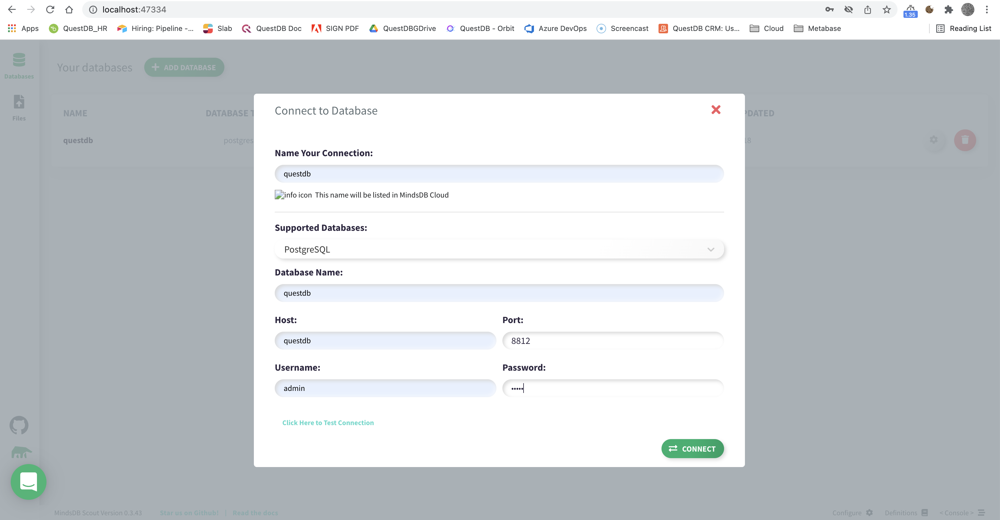

# Using QuestDB as a datasource for MindsDB

## Introduction

[MindsDB](https://mindsdb.com/) enables you to use Machine Learning to ask predictive questions about your data 
and receive accurate answers from it, all **in SQL**. With MindsDB: 

- *Developers* can quickly add AI capabilities to their applications.
- *Data scientists* can streamline MLOps by deploying ML models as 
  [AI Tables](https://docs.mindsdb.com/sql/tutorials/ai-tables/?h=ai#deep-dive-into-the-ai-tables).
- *Data analysts* can easily make forecasts on complex data, such as multivariate time-series with high 
  cardinality, and visualize these in BI tools like [Grafana](https://grafana.com/), and 
  [Tableau](https://www.tableau.com/).
 
[QuestDB](https://questdb.io/) is **the best open-source**, column-oriented SQL database for time-series type data. 
It has been designed and built for massively-parallelized vectorized execution, and SIMD, as the de-facto backend 
for high-performance demanding applications in financial services, IoT, IIoT, ML, DevOps and observability. 
QuestDB implements **ANSI SQL with additional extensions for time-specific queries**, which make it simple to correlate 
data from multiple sources using relational and time series joins, and execute aggregation functions with simplicity 
and speed. In addition, QuestDB is resources efficient (comparatively cheaper than other projects to run in cloud 
environments), simple to install, manage, use, and stable in all [production environments](https://questdb.io/customers/).   

Combining both MindsDB and QuestDB gives you unbound prediction ability with SQL. You can perform 
all the pre-processing of your data inside QuestDB using its powerful and [unique extended SQL](https://questdb.io/customers/), 
and then you can access these data from MindsDB, in its own [also unique SQL](https://docs.mindsdb.com/sql/), to produce 
powerful ML models.

The main goal of this article is to gently introduce these two deep technologies and give you enough 
understanding to be able to undertake very ambitious ML projects. To that end we will:

- Build a Docker image of **MindsDB** that is compatible with using **QuestDB** as a datasource.
- Spawn two Docker containers to run **MindsDB** and **QuestDB**.
- Add **QuestDB** as a datasource to **MindsDB** using MindsDB web console.
- Create a table and add data for a simple ML use case using **QuestDB**'s web console.
- Connect to **MindsDB** using `mysql` client and write some SQL.
- Create a predictor for our ML use case.
- Make some predictions about our data.

Have fun!

## Requirements

- [Docker](https://docs.docker.com/get-docker/): To build MindsDB's image. 
- [docker-compose](https://docs.docker.com/compose/install/): To define and run our multi-container 
  Docker application. It is usually installed implicitly when Docker is installed.
- [MySQL](https://formulae.brew.sh/formula/mysql): To interact with QuestDB and MindsDB
  (`mysql -h 127.0.0.1 --port 47335 -u mindsdb -p`).
- [Make](https://www.gnu.org/software/make/): Our CLI to build/run/stop Docker images/containers:
  - `make build-mindsdb-image`: Uses the Dockerfile file to build MindsDB's image `mindsdb/mindsdb:questdb_tutorial`.
  - `make compose-up`: Starts the containers of our multi-container application, `questdb` and `mindsdb`.
  - `make compose-down`: Stops/prunes the containers and their volumes. 
    
     Note: we use external folders to make MindsDB and QuestDB's data persistent across compose-{up | down}.
     You can remove all persisted data and configuration executing `remove_persisted_data`. Doing this means
     that the next time you start the containers you will need to add QuestDB again as a datasource.
- [Curl](https://curl.se/download.html): To check MindsDB's release build version.

Software repositories in case you are inclined to looking under the hood (**Give us a star!**):
- QuestDB: [https://github.com/questdb/questdb](https://github.com/questdb/questdb).
- MindsDB: [https://github.com/mindsdb/mindsdb](https://github.com/mindsdb/mindsdb).

## Build Mindsdb image

We can build a MindsDB Docker image locally with command:

```bash
make build-mindsdb-image
```

this takes some time, and results in a new image `mindsdb/mindsdb:questdb_tutorial`:

```bash
$ docker images
REPOSITORY        TAG                IMAGE ID       CREATED          SIZE
mindsdb/mindsdb   questdb_tutorial   38f294a5804b   14 minutes ago   8.91GB
```

The [**Dockerfile**](./Dockerfile) file used in the build process contains an explicit `pip install` command for 
the PostgreSQL type of datasource. This is required because QuestDB speaks 
[postgres-wire-protocol](https://questdb.io/docs/reference/api/postgres) with "3rd-party" integrations.

```dockerfile
RUN python -m pip install --prefer-binary --no-cache-dir --upgrade pip==22.0.4 && \
    pip install --prefer-binary --no-cache-dir wheel==0.37.1 && \
    pip install --prefer-binary --no-cache-dir mindsdb==$MINDSDB_VERSION && \
    pip install --prefer-binary --no-cache-dir mindsdb-datasources[postgresql] <--- THIS
```

Note: QuestDB also exposes a [REST API](https://questdb.io/docs/reference/api/rest/), 
a TCP/UDP socket based [text protocol](https://questdb.io/docs/reference/api/ilp/overview/) for optimised 
ingestion (closely implementing *InfluxDB Line Protocol* specification), and being 
[embeddable in Java applications](https://questdb.io/docs/reference/api/java-embedded).

## Running our multi-container Docker application

We have this [**docker-compose.yaml**](./docker-compose.yaml) file:

```yaml
version: '3.8'

services:
  questdb:
    image: questdb/questdb:latest
    container_name: questdb
    pull_policy: "always"
    restart: "always"
    ports:
      - "8812:8812"
      - "9000:9000"
      - "9009:9009"
    volumes:
      - ./qdb_root:/root/.questdb

  mindsdb:
    image: mindsdb/mindsdb:questdb_tutorial
    container_name: mindsdb
    restart: "always"
    ports:
      - "47334:47334"
      - "47335:47335"
      - "47336:47336"
      - "8000:8000"
    volumes:
      - .:/root
    depends_on:
      - questdb

networks:
  default:
    name: mindsdb-network
    driver: bridge
```

which allows us to start our two service containers with command:

```bash
make compose-up
```

- Conatiner`questdb`: Creates a local folder **qdb_root** to store table data/metadata, and the default server 
  configuration => available at [localhost:9000](http://localhost:9000).
- Conatiner `mindsdb`: Creates two local folders **mindsdb_store**, **nltk_data**, and uses configuration file 
  **mindsdb_config.json** => available at [localhost:47334](http://localhost:47334).
  
MindsDB takes about 60-90 seconds to become available, logs can be followed in the terminal:

```bash
docker logs -f mindsdb
...
Version 22.3.1.0
Configuration file:
   /root/mindsdb_config.json
Storage path:
   /root/mindsdb_store
http API: starting...
mysql API: starting...
mongodb API: starting...
 ✓ telemetry enabled
 ✓ telemetry enabled
 ✓ telemetry enabled
mongodb API: started on 47336
mysql API: started on 47335
http API: started on 47334
```

We can stop the two containers with command:

```bash
make compose-down
```

We can remove all persisted data and configuration executing:

```bash
remove_persisted_data
``` 

Note: Doing this means that the next time you start the containers you will need to add QuestDB again as a datasource,
as well as recreate the table, add data, and recreate your ML models.

## Adding QuestDB as a datasource

We can add QuestDB as a datasource to MindsDB by:

1. Browsing to MindsDB's web console at [localhost:47334](http://localhost:47334).
2. Clicking the green button labelled **ADD DATABASE**, which will prompt a dialog asking for QuestDB's connection 
   attributes, use these verbatim:

   | Attr. Name           | Attr. Value          |
   |----------------------| -------------------- |
   | Name Your Connection | questdb              |
   | Supported Databases  | PostgreSQL           |
   | Database Name        | questdb              |
   | Host                 | questdb              |
   | Port                 | 8812                 |
   | Username             | admin                |
   | Password             | quest                |

   Note: Host is `questdb`, the name of QuestDB's container, which runs along `mindsdb` on the same bridge 
   network `mindsdb-network`.



We can achieve the same by connecting to MindsDB ([Connecting to MindsDB](#connecting-to-mindsdb)) and executing:

```sql
USE mindsdb;

CREATE DATASOURCE questdb
    WITH ENGINE = "postgres",
    PARAMETERS = {
        "user": "admin",
        "password": "quest",
        "host": "questdb",
        "port": "8812",
        "database": "questdb",
        "public": true
    };
```

Note: in this case MindsDB's web console will not assign it a `Name Your Connection`.

## Adding data to QuestDB

We can access QuestDB's web console at [localhost:9000](http://localhost:9000):


and execute this DDL query to create a simple table (select the query and click `Run`):

```sql
CREATE TABLE IF NOT EXISTS house_rentals_data (
    number_of_rooms int,
    number_of_bathrooms int,
    sqft int,
    location symbol,
    neighborhood symbol,
    days_on_market int,
    rental_price float,
    ts timestamp
) timestamp(ts) PARTITION BY YEAR;
```

We can populate table `house_rentals_data` with random data ([excellent tutorial on this](https://questdb.io/tutorial/2022/03/14/mock-sql-timeseries-data-questdb/)):

```sql
INSERT INTO house_rentals_data SELECT * FROM (
    SELECT 
        rnd_int(1,6,0),
        rnd_int(1,3,0),
        rnd_int(180,2000,0),
        rnd_symbol('meh', 'good', 'great', 'amazing'),
        rnd_symbol('uptown', 'downtown', 'west_end', 'east_end', 'north_side', 'south_side'),
        rnd_int(1,20,0),
        rnd_float(0) * 1000 + 500,
        timestamp_sequence(
            to_timestamp('2021-01-01', 'yyyy-MM-dd'),
            14400000000L
        )
    FROM long_sequence(100)
);
```

This gives us a data point every 4 hours from 2021-01-16T12:00:00.000000Z (QuestDB's timestamps are UTC with 
microsecond precision). 

### Bonus material

QuestDB's web console allows us to download up to 1e6 rows at the time into a a CSV file. If your table has more 
rows than 1e6 then you can use the [LIMIT](https://questdb.io/docs/reference/sql/limit/) clause to select the 
appropriate rows, and you can download as many as you need 1e6 at the time:

```sql
SELECT * FROM house_rentals_data LIMIT 1, 1000000;
SELECT * FROM house_rentals_data LIMIT 1000001, 2000000;
SELECT * FROM house_rentals_data LIMIT 2000001, 3000000;
...
```

We can equally upload data from a local CSV file to QuestDB:

```bash
curl -F data=@sample_house_rentals_data.csv "http://localhost:9000/imp?forceHeader=true&name=house_rentals_data"
```

## Connecting to MindsDB

We can connect to MindsDB with a standard mysql-wire-protocol compliant client (no password, hit ENTER):

```bash
mysql -h 127.0.0.1 --port 47335 -u mindsdb -p
```

Only two databases are relevant to us, *mindsdb* and *questdb*:

    ```bash
    mysql> show databases;
    +--------------------+
    | Database           |
    +--------------------+
    | information_schema |
    | mindsdb            |
    | files              |
    | views              |
    | questdb            |
    +--------------------+
    5 rows in set (0.34 sec) 
    ```

### questdb 

This is a view on our QuestDB instance added as a PostgreSQL datasource in section 
[Adding QuestDB as a datasource](#adding-questdb-as-a-datasource). 
  
We can query it leveraging the full power of QuestDB's unique SQL syntax (SELECT queries only) 
because statements are sent over from MindsDB to QuestDB through a python client library that 
uses the postgres-wire-protocol and are not interpreted by MindsDB itself (MindsDB does not 
support QuestDB's syntax - To access it you first need to **USE questdb**, which in effect
activates the datasource): 

```bash
mysql> USE questdb --> MANDATORY;
Database changed
  
mysql> 
SELECT
    ts When,
    concat(neighborhood, '(', location, ')') Where,
    sum(days_on_market) 'Days Live',
    avg(rental_price) 'Avg Rent',
    min(rental_price) 'Min Rent'
FROM house_rentals_data
WHERE ts BETWEEN '2021-01-08' AND '2021-01-09'
SAMPLE BY 1h;
  
+--------------+-------------------+-----------+--------------------+----------+
| When         | Where             | Days Live | Avg Rent           | Min Rent |
+--------------+-------------------+-----------+--------------------+----------+
| 1610064000.0 | west_end(meh)     | 20        | 906.711669921875   | 906.712  |
| 1610078400.0 | north_side(meh)   | 10        | 590.3262939453125  | 590.326  |
| 1610092800.0 | uptown(great)     | 14        | 536.1471557617188  | 536.147  |
| 1610107200.0 | west_end(amazing) | 12        | 1278.8529052734375 | 1278.853 |
| 1610121600.0 | uptown(amazing)   | 6         | 1486.904296875     | 1486.904 |
| 1610136000.0 | east_end(amazing) | 7         | 1355.678466796875  | 1355.679 |
| 1610150400.0 | south_side(good)  | 4         | 718.14990234375    | 718.15   |
+--------------+-------------------+-----------+--------------------+----------+
7 rows in set (0.33 sec)
```
  
This query samples our data into 1h buckets then, only considering buckets that fall
between the 8th and 9th of January, it calculates various aggregation functions. The original
data was sampled at one data point per hour and our query attempts to sample it with a lower
resolution, therefore our data will contain gaps. QuestDB allows you to pick a 
[FILL strategy](https://questdb.io/docs/reference/sql/sample-by/#fill-options) and complete 
the missing data:

```sql
mysql> 
SELECT
    ts,
    neighborhood,
    location,
    sum(days_on_market) 'Days Live',
    avg(rental_price) 'Avg Rent',
    min(rental_price) 'Min Rent'
FROM house_rentals_data
WHERE ts BETWEEN '2021-01-08' AND '2021-01-09'
SAMPLE BY 1h
FILL(NULL);
+--------------+--------------+----------+-----------+--------------------+----------+
| ts           | neighborhood | location | Days Live | Avg Rent           | Min Rent |
+--------------+--------------+----------+-----------+--------------------+----------+
| 1610064000.0 | west_end     | meh      | 20.0      | 906.711669921875   | 906.712  | <- 2021-01-08 00:00:00.0
| 1610064000.0 | north_side   | meh      | nan       | nan                | nan      |
| 1610064000.0 | uptown       | great    | nan       | nan                | nan      |
| 1610064000.0 | west_end     | amazing  | nan       | nan                | nan      |
| 1610064000.0 | uptown       | amazing  | nan       | nan                | nan      |
| 1610064000.0 | east_end     | amazing  | nan       | nan                | nan      |
| 1610064000.0 | south_side   | good     | nan       | nan                | nan      |
| 1610067600.0 | west_end     | meh      | nan       | nan                | nan      | <- 2021-01-08 01:00:00.0
| 1610067600.0 | north_side   | meh      | nan       | nan                | nan      |
| 1610067600.0 | uptown       | great    | nan       | nan                | nan      |
| 1610067600.0 | west_end     | amazing  | nan       | nan                | nan      |
| 1610067600.0 | uptown       | amazing  | nan       | nan                | nan      |
| 1610067600.0 | east_end     | amazing  | nan       | nan                | nan      |
| 1610067600.0 | south_side   | good     | nan       | nan                | nan      |
| 1610071200.0 | west_end     | meh      | nan       | nan                | nan      | <- 2021-01-08 02:00:00.0
| 1610071200.0 | north_side   | meh      | nan       | nan                | nan      |
| 1610071200.0 | uptown       | great    | nan       | nan                | nan      |
| 1610071200.0 | west_end     | amazing  | nan       | nan                | nan      |
| 1610071200.0 | uptown       | amazing  | nan       | nan                | nan      |
| 1610071200.0 | east_end     | amazing  | nan       | nan                | nan      |
| 1610071200.0 | south_side   | good     | nan       | nan                | nan      |
| 1610074800.0 | west_end     | meh      | nan       | nan                | nan      | <- 2021-01-08 03:00:00.0
| 1610074800.0 | north_side   | meh      | nan       | nan                | nan      |
| 1610074800.0 | uptown       | great    | nan       | nan                | nan      |
| 1610074800.0 | west_end     | amazing  | nan       | nan                | nan      |
| 1610074800.0 | uptown       | amazing  | nan       | nan                | nan      |
| 1610074800.0 | east_end     | amazing  | nan       | nan                | nan      |
| 1610074800.0 | south_side   | good     | nan       | nan                | nan      |
| 1610078400.0 | west_end     | meh      | nan       | nan                | nan      | <- 2021-01-08 04:00:00.0
| 1610078400.0 | north_side   | meh      | 10.0      | 590.3262939453125  | 590.326  | <- 2021-01-08 04:00:00.0
| 1610078400.0 | uptown       | great    | nan       | nan                | nan      |
                   ...                                        ...


| 1610092800.0 | north_side   | meh      | nan       | nan                | nan      |
| 1610092800.0 | uptown       | great    | 14.0      | 536.1471557617188  | 536.147  |
| 1610092800.0 | west_end     | amazing  | nan       | nan                | nan      |
                   ...                                        ...


| 1610107200.0 | uptown       | great    | nan       | nan                | nan      |
| 1610107200.0 | west_end     | amazing  | 12.0      | 1278.8529052734375 | 1278.853 |
| 1610107200.0 | uptown       | amazing  | nan       | nan                | nan      |
| 1610107200.0 | east_end     | amazing  | nan       | nan                | nan      |
                   ...                                        ...


| 1610121600.0 | west_end     | amazing  | nan       | nan                | nan      |
| 1610121600.0 | uptown       | amazing  | 6.0       | 1486.904296875     | 1486.904 |
| 1610121600.0 | east_end     | amazing  | nan       | nan                | nan      |

                   ...                                        ...

| 1610136000.0 | uptown       | amazing  | nan       | nan                | nan      |
| 1610136000.0 | east_end     | amazing  | 7.0       | 1355.678466796875  | 1355.679 |
| 1610136000.0 | south_side   | good     | nan       | nan                | nan      |

                   ...                                        ...

| 1610150400.0 | east_end     | amazing  | nan       | nan                | nan      |
| 1610150400.0 | south_side   | good     | 4.0       | 718.14990234375    | 718.15   |
+--------------+--------------+----------+-----------+--------------------+----------+
175 rows in set (0.41 sec)
```

Beyond SELECT statements, for instance when we need to save the result of the above queries into new tables,
we need to use QuestDB's web console available at [localhost:9000](http://localhost:9000), and then we can 
create table `a_day_sampled_by_1h` like so:

```sql
CREATE TABLE a_day_sampled_by_1h AS (
    SELECT 
        ts as ts,
        neighborhood as neighborhood,
        location as location,
        sum(days_on_market) total_days_on_market, 
        avg(rental_price) avg_rent,
        min(rental_price) min_rent
    FROM house_rentals_data
    WHERE ts BETWEEN '2021-01-08' AND '2021-01-09'
    SAMPLE BY 1h
) TIMESTAMP(ts) PARTITION BY MONTH;
```


### mindsdb

Contains the metadata tables necessary to create ML models and add new datasources:

```bash
mysql> use mindsdb;
Database changed
  
mysql> show tables;
+-------------------+
| Tables_in_mindsdb |
+-------------------+
| predictors        |
  
         ...
  
| datasources       |
+-------------------+
3 rows in set (0.17 sec)
  
mysql> select * from datasources;
+---------+---------------+---------+------+-------+
| name    | database_type | host    | port | user  |
+---------+---------------+---------+------+-------+
| questdb | postgres      | questdb | 8812 | admin |
+---------+---------------+---------+------+-------+
1 row in set (0.19 sec)
```

## Creating a predictor

We can create a predictor model `mindsdb.home_rentals_model_ts` to predict `predicted_rental_price` 
for the next 2 days considering the past 10 days:

```sql
USE mindsdb;

CREATE PREDICTOR home_rentals_model_ts FROM questdb (
    SELECT number_of_rooms, location, neighborhood, days_on_market, rental_price, ts
    FROM house_rentals_data
)
PREDICT rental_price as predicted_rental_price
ORDER BY ts
WINDOW 10 HORIZON 2;
```

This triggers MindsDB to create/train the model based on the full data available from QuestDB's table 
`house_rentals_data` (100 rows) as a timeseries on column `ts`, with a history of 10 rows to predict 
the next 2.

You can see the progress by monitoring the log output of the `mindsdb` Docker container, and you can
ask MindsDB directly:

```bash
mysql> select * from predictors;
+-----------------------+------------+----------+--------------+---------------+-----------------+-------+-------------------+------------------+
| name                  | status     | accuracy | predict      | update_status | mindsdb_version | error | select_data_query | training_options |
+-----------------------+------------+----------+--------------+---------------+-----------------+-------+-------------------+------------------+
| home_rentals_model_ts | generating | NULL     | rental_price | up_to_date    | 22.3.1.0        | NULL  |                   |                  |
+-----------------------+------------+----------+--------------+---------------+-----------------+-------+-------------------+------------------+
1 row in set (0.34 sec)

mysql> select * from predictors;
+-----------------------+----------+----------+--------------+---------------+-----------------+-------+-------------------+------------------+
| name                  | status   | accuracy | predict      | update_status | mindsdb_version | error | select_data_query | training_options |
+-----------------------+----------+----------+--------------+---------------+-----------------+-------+-------------------+------------------+
| home_rentals_model_ts | training | NULL     | rental_price | up_to_date    | 22.3.1.0        | NULL  |                   |                  |
+-----------------------+----------+----------+--------------+---------------+-----------------+-------+-------------------+------------------+
1 row in set (0.28 sec)

mysql> select * from predictors;
+-----------------------+----------+--------------------+--------------+---------------+-----------------+-------+-------------------+------------------+
| name                  | status   | accuracy           | predict      | update_status | mindsdb_version | error | select_data_query | training_options |
+-----------------------+----------+--------------------+--------------+---------------+-----------------+-------+-------------------+------------------+
| home_rentals_model_ts | complete | 1.3742857938858857 | rental_price | up_to_date    | 22.3.1.0        | NULL  |                   |                  |
+-----------------------+----------+--------------------+--------------+---------------+-----------------+-------+-------------------+------------------+
1 row in set (0.18 sec)
```

When status is **complete** the model is ready for use, until then, we simply wait while we observe `mindsdb`'s 
logs, and repeat the query periodically. Creating/training a model will take time proportional to the number of features, 
i.e.cardinality of the source table as defined in the inner SELECT of the CREATE PREDICTOR statement, and the 
size of the corpus, i.e. number of rows. The model is a table in MindsDB:

```sql
mysql> USE mindsdb;
Database changed

mysql> show tables;
+-----------------------+
| Tables_in_mindsdb     |
+-----------------------+
| home_rentals_model_ts |
| predictors            |
| commands              |
| datasources           |
+-----------------------+
4 rows in set (0.21 sec)
```

## Querying MindsDB for predictions

TO BE CONTINUED ...

## MindsDB http api

MindsDB exposes a REST api, with swagger available at [http://localhost:47334/doc/](http://localhost:47334/doc/).

